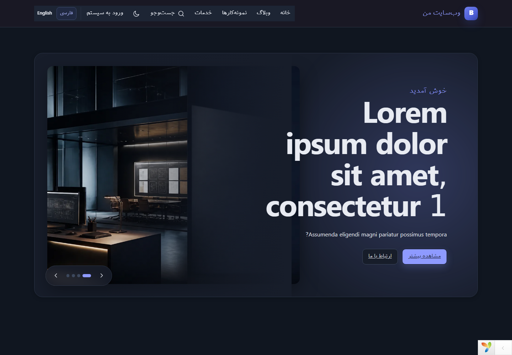
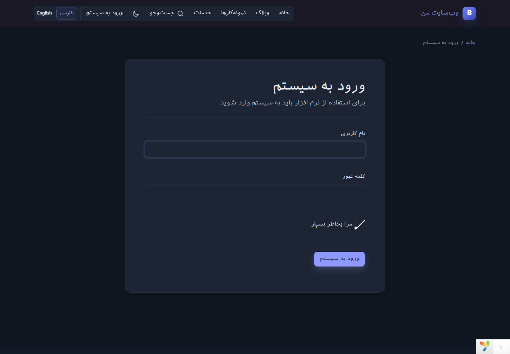

# وب‌سایت شرکتی مبتنی بر Yii2

این پروژه یک وب‌سایت شرکتی و سامانه مدیریت محتوا بر پایه Yii2 است. هدف آن این است که راه‌اندازی یک سایت حرفه‌ای به دانش فنی پیچیده نیاز نداشته باشد و کارهای روزمره، از انتشار محتوا تا بررسی درخواست‌های کاربران، از یک پنل مدیریت ساده و منظم انجام شود.

بخش عمومی و پنل مدیریت هر دو در برنامه `frontend` قرار دارند. این ساختار استقرار را ساده‌تر می‌کند و در عین حال مسیرهای مدیریتی مانند `/admin/blog` و `/admin/setting` با RBAC از سایت عمومی جدا می‌مانند.

## تصاویر برنامه

تصاویر زیر از اجرای محلی همین مخزن تهیه شده‌اند و ممکن است محتوای نمونه در نسخه‌های بعدی تغییر کند.

### صفحه اصلی فارسی



### ورود به پنل مدیریت



## قابلیت‌های پروژه

### محتوا و ساختار سایت

- مدیریت وبلاگ، دسته‌بندی‌ها و هشتگ‌ها
- صفحات پویا با نامک، تصویر شاخص و محتوای چندزبانه
- پیش‌نویس، انتشار فوری و انتشار زمان‌بندی‌شده
- تنظیم SEO، canonical، robots و Open Graph برای هر صفحه
- مدیریت منوی اصلی و فوتر، زیرمنوها و ترتیب نمایش
- مدیریت و جابه‌جایی بخش‌های صفحه اصلی با Drag & Drop
- مدیریت اسلایدشو، نمونه‌کارها و پرسش‌های متداول
- کتابخانه رسانه با پیش‌نمایش و بارگذاری امن فایل
- جست‌وجوی صفحات و نوشته‌های منتشرشده

### فرم‌ها و ارتباط با کاربران

- فرم ارتباط با ما، سفارش نرم‌افزار و دعوت به همکاری
- اعلان درخواست‌های تازه در سایت عمومی و پنل مدیریت برای مدیران مجاز
- نمایش وضعیت خوانده‌شده یا خوانده‌نشده هر درخواست
- اعلان ایمیلی مستقل برای هر فرم
- تنظیم SMTP و آزمایش اتصال از پنل
- نگهداری رزومه‌ها خارج از Web Root و دانلود از مسیر محافظت‌شده

### پنل مدیریت

- پیشخوان قابل شخصی‌سازی با ابزارک‌های جابه‌جاشونده و جمع‌شونده
- آمار تجمیعی بازدیدکنندگان، کشورها و صفحات پربازدید
- دسترسی سریع قابل تنظیم برای هر مدیر
- نقش‌های `superAdmin`، `admin` و `editor`
- گزارش فعالیت مدیران و خروجی CSV داده‌ها
- پاک‌سازی Cache و Assetها
- Maintenance Mode با پاسخ استاندارد 503
- پشتیبان‌گیری و بازیابی نسخه‌دار دیتابیس
- مدیریت شبکه‌های اجتماعی و نمایش آن‌ها در فوتر

### چندزبانه و واکنش‌گرا

- مسیرهای زبان‌دار مانند `/fa/blog` و `/en/blog`
- پشتیبانی هم‌زمان از RTL و LTR
- زبان مستقل برای سایت و پنل مدیریت
- ترجمه رابط با Yii i18n و ذخیره ترجمه محتوا در دیتابیس
- زبان جایگزین در صورت کامل‌نبودن ترجمه
- تولید خودکار `lang`، `dir`، canonical و `hreflang`
- طراحی واکنش‌گرا و پوسته روشن، تیره یا هماهنگ با سیستم‌عامل

## تجربه نصب و استفاده

یکی از هدف‌های اصلی پروژه کوتاه‌کردن مسیر میان دریافت سورس و آماده‌شدن سایت است. نصب‌کننده وب پیش‌نیازها و دسترسی پوشه‌ها را بررسی می‌کند، اتصال دیتابیس را می‌آزماید، migrationها را اجرا می‌کند و حساب مدیر ارشد را می‌سازد. پس از پایان نصب نیز Installer قفل می‌شود تا دوباره و ناخواسته اجرا نشود.

در پنل مدیریت هم تلاش شده کارهای معمول به تنظیمات فنی وابسته نباشند. ویرایش محتوا، تنظیم منو، مشاهده پیام‌ها، تغییر ظاهر و نگهداری سایت از بخش‌های مشخص انجام می‌شوند و دسترسی هر قسمت با نقش کاربر کنترل می‌شود.

## فناوری‌های استفاده‌شده

| فناوری | کاربرد |
| --- | --- |
| PHP 8.2 | زبان اصلی برنامه |
| Yii 2.0.55 | MVC، مسیریابی، Active Record، migration، اعتبارسنجی فرم‌ها و RBAC |
| MySQL / MariaDB | ذخیره اطلاعات با charset استاندارد `utf8mb4` |
| Composer | مدیریت وابستگی‌های PHP و فرمان‌های کنترل کیفیت |
| Tailwind CSS 4 | تولید CSS بهینه و ابزارهای چیدمان |
| daisyUI 5 | اجزایی مانند دکمه، کارت، Modal، Tab و Toggle |
| Design System داخلی | رنگ، تایپوگرافی، فاصله و رفتار هماهنگ RTL/LTR |
| JavaScript بدون فریم‌ورک | اسلایدشو، Drag & Drop، Modal و انتخاب پوسته |
| PHPUnit 10 | تست‌های واحد و یکپارچه |
| PHPStan و PHP_CodeSniffer | تحلیل ایستا و کنترل شیوه نگارش کد |
| GitHub Actions | build، ممیزی امنیتی، تست و آزمایش نصب از صفر |

کلاس‌های daisyUI با پیشوند `d-` تولید می‌شوند تا با اجزای Yii یا CSSهای پروژه تداخل نداشته باشند. ورودی Tailwind در `frontend/web/css/src/app.css` و خروجی آماده انتشار در `frontend/web/css/app.css` است. tokenها و قواعد اختصاصی نیز در `frontend/web/css/design-system.css` نگهداری می‌شوند.

## پیش‌نیازها

- PHP 8.2 یا یکی از نسخه‌های سازگار PHP 8
- Composer 2
- MySQL 8 یا MariaDB سازگار با `utf8mb4`
- Node.js نسخه LTS و npm برای توسعه رابط کاربری
- افزونه‌های PHP: `mbstring`، `openssl`، `pdo_mysql` و `fileinfo`

فعال‌بودن `intl`، `gd` و `zip` نیز توصیه می‌شود. CAPTCHA برای نمایش تصویر به `gd` نیاز دارد.

## نصب پیشنهادی با مرورگر

ابتدا وابستگی‌ها را دریافت و برنامه را مقداردهی کنید:

```powershell
composer install
php init --env=Production --overwrite=All
```

Document Root وب‌سرور را روی `frontend/web` قرار دهید و نشانی زیر را باز کنید:

```text
https://example.com/install.php
```

نصب‌کننده زبان، پیش‌نیازهای PHP، دسترسی پوشه‌ها، دیتابیس، migrationها، حساب مدیر و مشخصات سایت را مرحله‌به‌مرحله دریافت می‌کند. اطلاعات حساس وارد Git نمی‌شوند و رمز مدیر در فایل تنظیمات ذخیره نمی‌شود.

پس از نصب، فایل `.install.lock` در ریشه پروژه ساخته می‌شود و دسترسی دوباره به Installer پاسخ 403 می‌دهد. اگر نصب پیش از مرحله نهایی متوقف شود، lock ساخته نمی‌شود و پس از رفع خطا می‌توان نصب را ادامه داد.

## نصب از خط فرمان

همان فرایند برای سرورهای بدون رابط گرافیکی از طریق CLI در دسترس است:

```powershell
php yii install
```

برای نصب خودکار، مقادیر لازم را به‌صورت Environment Variable در اختیار فرمان قرار دهید:

```dotenv
DB_HOST=127.0.0.1
DB_PORT=3306
DB_NAME=yii2_website
DB_USER=root
DB_PASSWORD=
ADMIN_USERNAME=admin
ADMIN_EMAIL=admin@example.com
ADMIN_PASSWORD=
SITE_NAME="نام وب‌سایت"
APP_URL=https://example.com
```

برای بررسی پیش‌نیازها، مسیرهای قابل‌نوشتن و اتصال فعلی دیتابیس بدون انجام نصب:

```powershell
php yii install/check
```

برای نصب مجدد یک سایت فعال، ابتدا از دیتابیس و فایل `.env` نسخه پشتیبان بگیرید. فایل lock را فقط زمانی حذف کنید که از نتیجه نصب دوباره آگاه هستید.

## نصب دستی برای توسعه

```powershell
composer install
npm install
php init --env=Development --overwrite=All
Copy-Item .env.example .env
php yii migrate --interactive=0
php yii seed
npm run build
```

پیش از migration، اطلاعات دیتابیس را در `.env` وارد کنید. این فایل در Git نادیده گرفته می‌شود و اطلاعات ورود دیتابیس نباید در فایل دیگری از مخزن قرار بگیرد.

فرمان `seed` تنظیمات پایه، حساب مدیر و داده‌های نمایشی لازم برای بررسی صفحات را می‌سازد. برای نصب بدون محتوای نمونه اجرا کنید:

```powershell
php yii seed 0
```

ساخت دیتابیس به dump قدیمی وابسته نیست؛ تمام جدول‌ها، indexها، foreign keyها و RBAC از طریق migration ساخته می‌شوند.

## اجرای محلی

```powershell
php yii serve --docroot=frontend/web 127.0.0.1:8080
```

- سایت: <http://127.0.0.1:8080/fa>
- پنل مدیریت: <http://127.0.0.1:8080/admin>

در Apache، Nginx یا XAMPP نیز Document Root باید دقیقاً روی `frontend/web` باشد. ریشه مخزن نباید از طریق وب در دسترس قرار بگیرد.

## توسعه رابط کاربری

برای ساخت CSS هنگام توسعه و مشاهده تغییرات:

```powershell
npm run dev
```

برای ساخت نسخه minifyشده قابل انتشار:

```powershell
npm run build
```

در صفحه‌های جدید ابتدا از componentها و tokenهای موجود استفاده کنید. این کار ظاهر سایت را یک‌دست نگه می‌دارد و از CSS پراکنده یا ناسازگاری RTL و LTR جلوگیری می‌کند.

## افزودن زبان جدید

زبان پیش‌فرض سایت و پنل در `.env` قابل تنظیم است:

```dotenv
APP_LANGUAGE=fa
ADMIN_LANGUAGE=fa
```

مشخصات زبان جدید را در `frontend/config/params.php` اضافه و فایل پیام آن را در مسیر زیر ایجاد کنید:

```text
frontend/messages/<locale>/app.php
```

مسیریابی، جهت صفحه و انتخاب‌گر زبان از همین تنظیمات ساخته می‌شوند و نیازی به تغییر کنترلرها نیست. ترجمه محتوای صفحات، نوشته‌ها، دسته‌بندی‌ها و منوها در جدول `content_translation` ذخیره می‌شود.

## امنیت و دسترسی‌ها

- تمام مسیرهای مدیریت به ورود و permission مناسب نیاز دارند.
- عملیات تغییردهنده با POST و CSRF معتبر انجام می‌شوند.
- فایل‌ها بر اساس MIME واقعی، پسوند و اندازه اعتبارسنجی می‌شوند.
- نام فایل بارگذاری‌شده را سرور تولید می‌کند.
- HTML ورودی ادیتور پیش از نمایش پاک‌سازی می‌شود.
- ورود و فرم‌های عمومی محدودیت درخواست دارند.
- Session ID پس از ورود بازتولید می‌شود و خروج فقط با POST انجام می‌شود.
- رمز SMTP رمزنگاری می‌شود و دوباره در فرم نمایش داده نمی‌شود.
- IP و User-Agent خام برای آمار بازدید نگهداری نمی‌شوند.
- Debug و Gii فقط برای محیط توسعه در نظر گرفته شده‌اند.

## نگهداری سایت

تنظیمات ایمیل در `/admin/setting/email`، ابزارهای Cache و Maintenance Mode در `/admin/setting/system` و پشتیبان‌گیری در `/admin/backup` قرار دارند. بازیابی دیتابیس فقط برای `superAdmin` و پس از تأیید صریح انجام می‌شود؛ پیش از Restore همیشه یک نسخه پشتیبان تازه بگیرید.

گزارش فعالیت مدیران از `/admin/audit` و خروجی CSV فرم‌ها و صفحات از `/admin/export` در دسترس کاربران مجاز است.

## ارتقای نسخه موجود

پیش از ارتقا از دیتابیس، فایل `.env` و فایل‌های بارگذاری‌شده نسخه پشتیبان بگیرید. سپس وابستگی‌ها، migrationها و assetهای frontend را به‌روزرسانی و تست‌ها را اجرا کنید. دستورالعمل مرحله‌به‌مرحله و روش بازگشت در صورت خطا در [راهنمای ارتقا](docs/update.md) آمده است.

## گزارش مشکلات امنیتی

آسیب‌پذیری‌های امنیتی را در Issue عمومی همراه با جزئیات سوءاستفاده منتشر نکنید. روش گزارش خصوصی، اطلاعات موردنیاز و روند رسیدگی در [سیاست امنیت](SECURITY.md) توضیح داده شده است.

## مشارکت در توسعه

پیش از ارسال Pull Request، [راهنمای مشارکت](CONTRIBUTING.md) را بخوانید و بررسی‌های `composer ci` و `npm run build` را اجرا کنید. تغییرات دیتابیس باید migration برگشت‌پذیر و قابلیت‌های جدید باید تست، ترجمه و مستندات داشته باشند.

## کنترل کیفیت

این فرمان‌ها همان بررسی‌هایی را اجرا می‌کنند که GitHub Actions در Push و Pull Request انجام می‌دهد:

```powershell
composer check:composer
composer security:audit
composer lint
composer style
composer analyse
composer test:prepare
composer test
composer test:install
npm audit --audit-level=moderate
npm run build
```

`composer test:install` نصب کامل پروژه را روی یک دیتابیس خالی آزمایش می‌کند؛ بنابراین تغییر migrationها یا Installer باید همراه با این تست بررسی شود.

## ساختار مسیرهای مهم

```text
common/                 اجزای مشترک، تنظیمات و سرویس Installer
console/controllers/    فرمان‌های CLI مانند install و seed
console/migrations/     تاریخچه ساخت و تغییر دیتابیس
frontend/controllers/   کنترلرهای صفحات عمومی
frontend/messages/      ترجمه رابط کاربری
frontend/models/        مدل‌های سایت و فرم‌ها
frontend/modules/admin/ پنل مدیریت
frontend/views/         قالب و صفحات عمومی
frontend/web/           Document Root، CSS، JavaScript و تصاویر
tests/                  تست‌های واحد و یکپارچه
```

راهنماهای کامل‌تر در پوشه `docs` قرار دارند:

- [نصب](docs/installation.md)
- [پیکربندی](docs/configuration.md)
- [استقرار](docs/deployment.md)
- [ارتقا](docs/update.md)
- [امنیت](docs/security.md)
- [چندزبانه‌سازی](docs/multilingual.md)
- [راهنمای مدیریت](docs/administration.md)
- [توسعه](docs/development.md)
- [رفع اشکال](docs/troubleshooting.md)
- [مشارکت](docs/contributing.md)

نام جدول‌ها و ستون‌ها از الگوی `snake_case` پیروی می‌کند. برای به‌روزرسانی نسخه موجود، پس از تهیه نسخه پشتیبان migrationهای جدید را اجرا کنید:

```powershell
php yii migrate
```

## مجوز

شرایط استفاده و انتشار پروژه در فایل [LICENSE](LICENSE) نوشته شده است.
